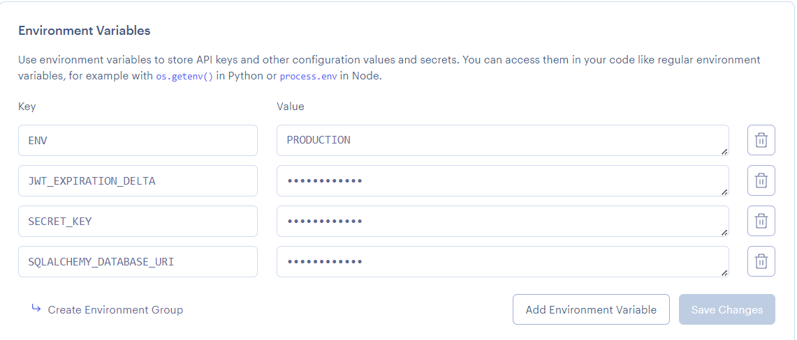
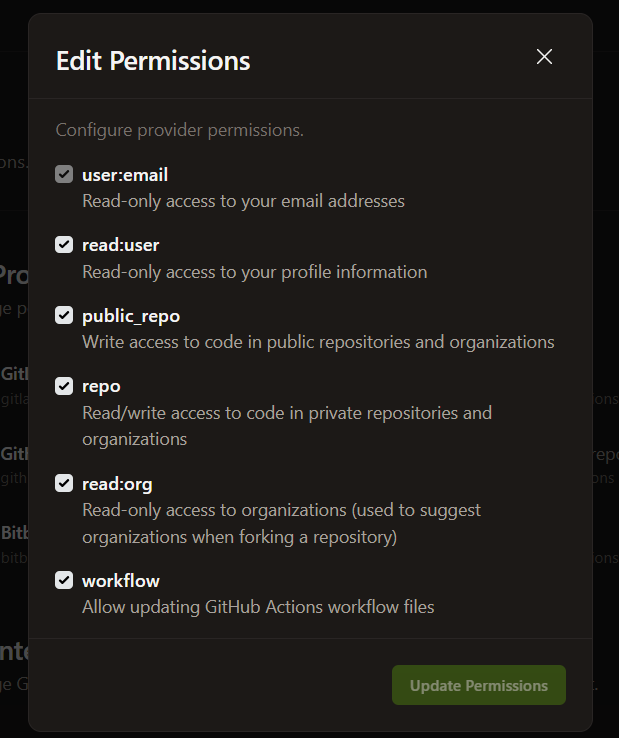

# DEPLOYED APP
https://react-frontend-api-prooject.onrender.com/
user login - username: bob, password: bobpass
admin login - username: admin, password: adminpass

--NOTE: Render's Web appication firewall (WAF) blocks requests made to the create user endpoint, resulting in a 403 forbidden error. This is due to the presence of the is_admin variable, and render is liekly blocking it to prevent self-assignment of admin privelges. This highlights an area for improvement in the project, where systems shouldn't allow unauthenticated self-registration to set admin status directly.
## POSTMAN LINK
https://best-team-ever-6394.postman.co/workspace/Jeremy-Lovell~30c224b7-9605-4f91-af1e-30da2f07cb2a/collection/42532979-d724725d-96a1-44de-8e68-efc65c8a5453?action=share&source=copy-link&creator=42532979

## CLI COMMANDS
List commands allow for the entrance of page, per page, and sorting variables. Some also allow for the entrance of a particular object feature for filtering.
All commands include default values for input values, allowing for easier and faster cli usage.
For sorting, you may enter a descending by entering the name of the feature with a "-" prefix. Example inputs: -capacity (desc), capacity (asc), "" (no sort)

### User commands
#### Create User
flask cli_client "create user" "username" "password" "is_admin (True/False)"
#### Login
flask cli_client "login" "username" "password"

### Flight commands
#### list Flights
flask cli_client "list flights" "page number" "per page amount" "destination" "sorting" 
#### create Flight - please note, a plane or pilot cannot be assined to a flight with a flight time that clashes with a pre-existing flight
flask cli_client "create flight" "plane ID" "pilot ID" "departure time" "arrival time" "departure destination" "destination"
#### update Flight - please note, a plane or pilot cannot be assined to a flight with a flight time that clashes with a pre-existing flight
flask cli_client "update flight" "flight ID" "plane ID" "pilot ID" "departure time" "arrival time" "departure destination" "destination"
#### delete flight
flask cli_client "delete flight" "flight ID"

### Plane Commands
#### list planes
flask cli_client "list planes" "page number" "per page amount" "model" "sorting"
#### create plane
flask cli_client "create plane" "model" "capacity"
#### update plane
flask cli_client "update plane" "plane ID" "model" "capacity"
#### delete plane
flask cli_client "delete plane" "plane ID"

### Pilot Commands
#### list pilots
flask cli_client "list pilots" "page number" "per page amount" "sorting"
#### create pilot
flask cli_client "create pilot" "name"
#### update pilot
flask cli_client "update pilot" "pilot ID" "name"
#### delete pilot
flask cli_client "delete pilot" "pilot ID"

### Gate Commands
#### list gates
flask cli_client "list gates" "page number" "per page amount" "sorting"
#### create gate - please note, flights already assigned to gates cannot be assigned to a newly created gate
flask cli_client "create gate" "flight ID" "terminal"
#### update plane - please note, flights already assigned to gates cannot be assigned to a newly updated gate
flask cli_client "update gate" "gate ID" "flight ID" "terminal"
#### delete plane
flask cli_client "delete gate" "gate ID"


# Flask MVC Template
A template for flask applications structured in the Model View Controller pattern [Demo](https://dcit-flaskmvc.herokuapp.com/). [Postman Collection](https://documenter.getpostman.com/view/583570/2s83zcTnEJ)


# Dependencies
* Python3/pip3
* Packages listed in requirements.txt

# Installing Dependencies
```bash
$ pip install -r requirements.txt
```

# Configuration Management


Configuration information such as the database url/port, credentials, API keys etc are to be supplied to the application. However, it is bad practice to stage production information in publicly visible repositories.
Instead, all config is provided by a config file or via [environment variables](https://linuxize.com/post/how-to-set-and-list-environment-variables-in-linux/).

## In Development

When running the project in a development environment (such as gitpod) the app is configured via default_config.py file in the App folder. By default, the config for development uses a sqlite database.

default_config.py
```python
SQLALCHEMY_DATABASE_URI = "sqlite:///temp-database.db"
SECRET_KEY = "secret key"
JWT_ACCESS_TOKEN_EXPIRES = 7
ENV = "DEVELOPMENT"
```

These values would be imported and added to the app in load_config() function in config.py

config.py
```python
# must be updated to inlude addtional secrets/ api keys & use a gitignored custom-config file instad
def load_config():
    config = {'ENV': os.environ.get('ENV', 'DEVELOPMENT')}
    delta = 7
    if config['ENV'] == "DEVELOPMENT":
        from .default_config import JWT_ACCESS_TOKEN_EXPIRES, SQLALCHEMY_DATABASE_URI, SECRET_KEY
        config['SQLALCHEMY_DATABASE_URI'] = SQLALCHEMY_DATABASE_URI
        config['SECRET_KEY'] = SECRET_KEY
        delta = JWT_ACCESS_TOKEN_EXPIRES
...
```

## In Production

When deploying your application to production/staging you must pass
in configuration information via environment tab of your render project's dashboard.



# Flask Commands

wsgi.py is a utility script for performing various tasks related to the project. You can use it to import and test any code in the project. 
You just need create a manager command function, for example:

```python
# inside wsgi.py

user_cli = AppGroup('user', help='User object commands')

@user_cli.cli.command("create-user")
@click.argument("username")
@click.argument("password")
def create_user_command(username, password):
    create_user(username, password)
    print(f'{username} created!')

app.cli.add_command(user_cli) # add the group to the cli

```

Then execute the command invoking with flask cli with command name and the relevant parameters

```bash
$ flask user create bob bobpass
```


# Running the Project

_For development run the serve command (what you execute):_
```bash
$ flask run
```

_For production using gunicorn (what the production server executes):_
```bash
$ gunicorn wsgi:app
```

# Deploying
You can deploy your version of this app to render by clicking on the "Deploy to Render" link above.

# Initializing the Database
When connecting the project to a fresh empty database ensure the appropriate configuration is set then file then run the following command. This must also be executed once when running the app on heroku by opening the heroku console, executing bash and running the command in the dyno.

```bash
$ flask init
```

# Database Migrations
If changes to the models are made, the database must be'migrated' so that it can be synced with the new models.
Then execute following commands using manage.py. More info [here](https://flask-migrate.readthedocs.io/en/latest/)

```bash
$ flask db init
$ flask db migrate
$ flask db upgrade
$ flask db --help
```

# Testing

## Unit & Integration
Unit and Integration tests are created in the App/test. You can then create commands to run them. Look at the unit test command in wsgi.py for example

```python
@test.command("user", help="Run User tests")
@click.argument("type", default="all")
def user_tests_command(type):
    if type == "unit":
        sys.exit(pytest.main(["-k", "UserUnitTests"]))
    elif type == "int":
        sys.exit(pytest.main(["-k", "UserIntegrationTests"]))
    else:
        sys.exit(pytest.main(["-k", "User"]))
```

You can then execute all user tests as follows

```bash
$ flask test user
```

You can also supply "unit" or "int" at the end of the comand to execute only unit or integration tests.

You can run all application tests with the following command

```bash
$ pytest
```

## Test Coverage

You can generate a report on your test coverage via the following command

```bash
$ coverage report
```

You can also generate a detailed html report in a directory named htmlcov with the following comand

```bash
$ coverage html
```

# Troubleshooting

## Views 404ing

If your newly created views are returning 404 ensure that they are added to the list in main.py.

```python
from App.views import (
    user_views,
    index_views
)

# New views must be imported and added to this list
views = [
    user_views,
    index_views
]
```

## Cannot Update Workflow file

If you are running into errors in gitpod when updateding your github actions file, ensure your [github permissions](https://gitpod.io/integrations) in gitpod has workflow enabled 

## Database Issues

If you are adding models you may need to migrate the database with the commands given in the previous database migration section. Alternateively you can delete you database file.


